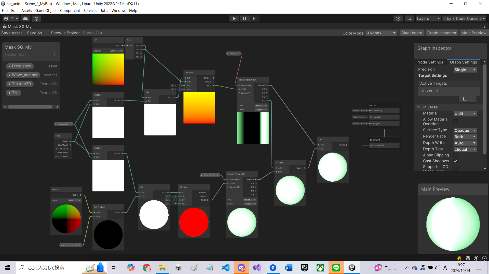
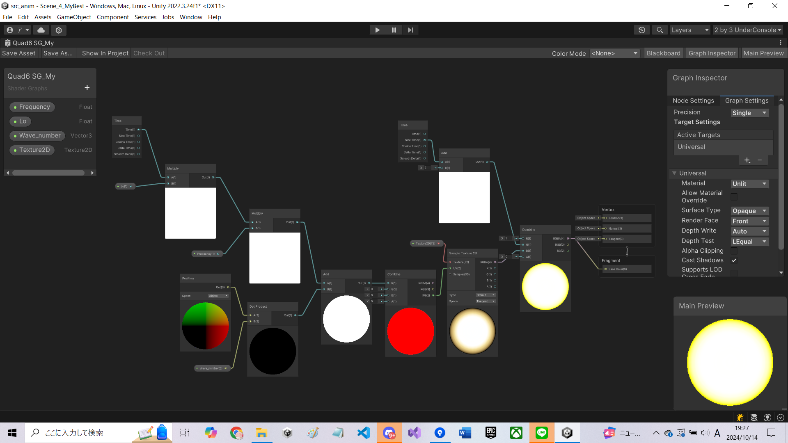

## 光を走らせる

主にシェーダを使ってループアニメーションを実装します。

# 自分なりに変更した点
上の輪っかは光が回転するのと光が走るのを組み合わせました
下の球体は光るようにしました

# 進め方

- 本リポジトリをフォークしてください
- フォークしたリポジトリをcloneします
- Unityのプロジェクトを更新して実装してください。
  - 結果画像1（一番上の画像）と同じシーンをScene_1_Cylinderに実現してください
  - 結果画像2（二番目の画像）と同じシーンをScene_2_Quadに実現してください
  - 結果画像3（三番目の画像）と同じシーンをScene_3_Maskに実現してください
  - 自分なりにかっこいいシーンをScene_4_MyBestに作成してください
- このテキストファイルに変更点を記載してください
- Scene_4_MyBestの結果をUnity RecorderでMovieとして保存し、result.gifと差し替えてください（サイズが大きくて上げられない場合は、解像度を小さくするなどして下さい）
- node_graph.pngを自分のシェーダグラフの一番頑張ったノードと差し替えてください
- プルリクエストを出して提出してください
